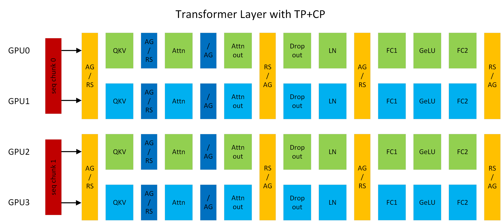
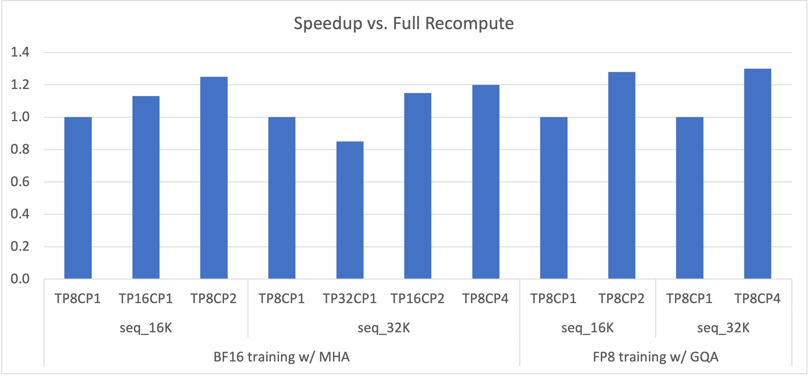

<!---
   Copyright (c) 2022-2026, NVIDIA CORPORATION. All rights reserved.
   NVIDIA CORPORATION and its licensors retain all intellectual property
   and proprietary rights in and to this software, related documentation
   and any modifications thereto. Any use, reproduction, disclosure or
   distribution of this software and related documentation without an express
   license agreement from NVIDIA CORPORATION is strictly prohibited.
-->

# context_parallel 包

## 上下文并行概述

*图 1：使用 TP2CP2 运行的 Transformer 层。注意力机制旁边的通信用于 CP，其他通信用于 TP。(AG/RS：前向传播中的 all-gather 和反向传播中的 reduce-scatter，RS/AG：前向传播中的 reduce-scatter 和反向传播中的 all-gather，/AG：前向传播中无操作，反向传播中 all-gather)。*

上下文并行（"CP"）是一种在序列长度维度上的并行化方案。与之前仅分割 Dropout 和 LayerNorm 激活序列的 SP（序列并行）不同，CP 沿着序列维度对网络输入和所有激活进行分区。使用 CP 时，除了注意力机制（例如，Linear、LayerNorm 等）之外的所有模块都可以像往常一样工作，无需任何更改，因为它们没有 token 间的操作。至于注意力机制，每个 token 的 Q（查询）需要与同一序列中所有 token 的 KV（键和值）进行计算。因此，CP 需要跨 GPU 进行额外的 all-gather 操作来收集完整的 KV 序列。相应地，在反向传播中，应该对 KV 的激活梯度应用 reduce-scatter 操作。为了减少激活内存占用，每个 GPU 在前向传播中只存储一个序列块的 KV，并在反向传播中再次收集 KV。KV 通信发生在一个 GPU 与其他 TP 组中的对应 GPU 之间。all-gather 和 reduce-scatter 在底层被转换为环形拓扑中的点对点通信。交换 KV 也可以利用 MQA/GQA 来减少通信量，因为它们只有一个或几个注意力头用于 KV。

例如，在图 1 中，假设序列长度为 8K，每个 GPU 处理 4K 个 token。GPU0 和 GPU2 组成一个 CP 组，它们彼此交换 KV。GPU1 和 GPU3 之间也发生同样的事情。CP 类似于 [Ring Attention](https://arxiv.org/abs/2310.01889)，但通过以下方式提供了更好的性能：(1) 利用最新的 OSS 和 cuDNN flash attention 内核；(2) 消除由低三角因果掩码导致的不必要计算，并在 GPU 之间实现最佳负载平衡。

## 上下文并行的优势

*图 2：175B GPT 模型使用各种 TP+CP 组合与完全重计算（即 TP8CP1）相比的加速比。*

LLM 在处理长上下文（即长序列长度）时会遇到 OOM（内存不足）问题，因为激活的内存占用线性增加。在反向传播中重计算激活可以避免 OOM，但也会引入显著的开销（完全重计算时约 30%）。扩大 TP（张量模型并行）也可以解决 OOM 问题，但它可能使计算（例如，Linear）变得太短，无法与通信延迟重叠。需要明确的是，无论是否发生 OOM，通过更大的 TP 扩展到更多 GPU 都可能遇到重叠问题。
CP 能够更好地解决这些问题。通过 CP，每个 GPU 仅计算序列的一部分，这可以将计算和通信都减少 CP 倍。因此，无需再担心它们之间的重叠问题。每个 GPU 的激活内存占用也减少了 CP 倍，因此不再存在 OOM 问题。如图 2 所示，TP 和 CP 的组合可以通过消除重计算开销，并在计算与通信之间做出最佳权衡，从而实现最优性能。

## 启用上下文并行

CP 支持已添加到 GPT 中。所有共享 GPT 代码路径的模型也应该能够受益于 CP，例如 Llama。CP 可以与 TP（张量模型并行）、PP（流水线模型并行）和 DP（数据并行）协同工作，其中 GPU 的总数等于 TPxCPxPPxDP。CP 还可以与不同的注意力变体配合使用，包括 MHA/MQA/GQA、单向和双向掩码。

只需在命令行中设置 `context_parallel_size=<CP_SIZE>` 即可启用 CP。默认的 `context_parallel_size` 为 1，这意味着 CP 被禁用。运行 CP 需要 Megatron-Core (>=0.5.0) 和 Transformer Engine (>=1.1)。