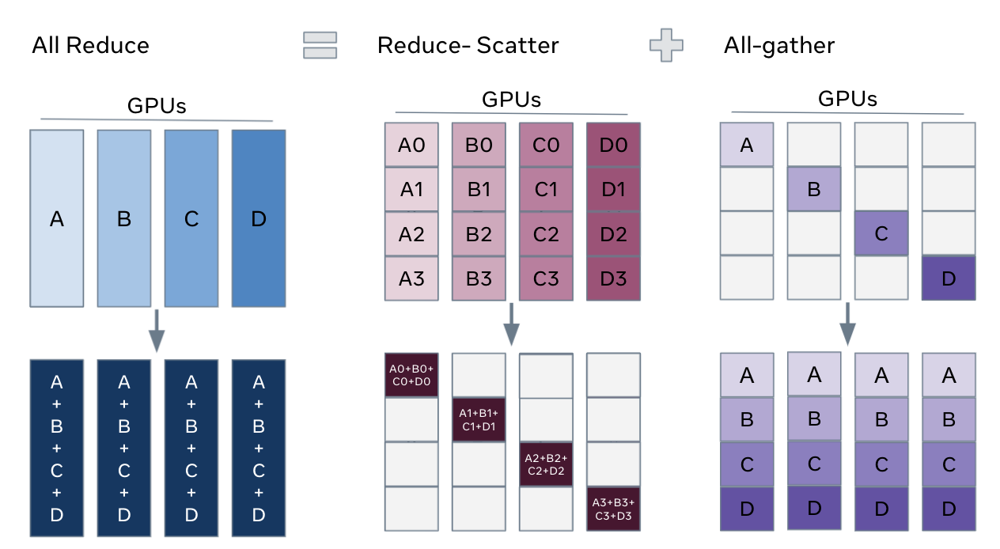

<!---
   Copyright (c) 2022-2026, NVIDIA CORPORATION. All rights reserved.
   NVIDIA CORPORATION 及其许可方保留对本软件、相关文档
   及其任何修改的所有知识产权和专有权利。未经 NVIDIA CORPORATION
   明确许可协议授权，严禁任何使用、复制、披露或分发本软件及相关文档的行为。
-->

# Megatron FSDP

**注意：在 M-Core 0.14 版本中，自定义 FSDP 重构了其检查点实现，以使用基于 DTensor 的 torch 分布式检查点。自定义 FSDP 也被重命名为 Megatron FSDP。本文档的相关部分已不再适用。**

## 如何使用？

添加以下标志以启用 MCore 自定义 FSDP。

```bash
--use-megatron-fsdp
--data-parallel-sharding-strategy optim_grads_params
--no-gradient-accumulation-fusion
--use-distributed-optimizer
```

有关涵盖所需配置、检查点转换和示例脚本的实用指南，请参阅 [Megatron-FSDP 用户指南](../../discussions/megatron-fsdp-user-guide/megatron-fsdp-user-guide.md)。

## 主要特性

- **分片策略**：高效地对优化器状态、梯度和参数进行分片，以减少内存消耗。
- **通信与计算重叠**：经过优化，可实现通信与计算的并发执行，从而提高整体效率。
- **支持自动混合精度训练**：兼容 BF16 O1/O2/O3 配置方案，以及 FP8 计算（FP32 参数）和 FP8 参数训练，允许灵活的精度配置。
- **张量并行 (TP)、专家并行 (EP) 和上下文并行 (CP)**：兼容 TP、EP 和 CP 配置，支持大型语言模型的高效扩展。
- **使用 Meta Device 进行分布式模型初始化**：允许使用元设备初始化模型，然后通过 `Module.reset_parameters` API 逐层初始化分布式模型权重缓冲区，便于初始化超大型模型。

## 配置建议

### 1. 禁用 `CUDA_DEVICE_MAX_CONNECTIONS`

为确保 FSDP 通信与计算完全并行化，请禁用 `CUDA_DEVICE_MAX_CONNECTIONS` 环境变量。此步骤可避免 CUDA 流中可能出现的性能瓶颈。（但这可能会在一定程度上减慢 TP 和 CP 的速度。）

```bash
unset CUDA_DEVICE_MAX_CONNECTIONS
```

### 2. 添加 `--calculate-per-token-loss`

对于梯度分片模式优化，请在训练脚本中包含 `--calculate-per-token-loss` 标志。这通过减少梯度缩放的频率来提高性能，梯度缩放也是 SM 资源的一个相当大的消耗源。

## 自定义 FSDP 的设计

### 1. 概述

Megatron-Core 中的自定义全分片数据并行 (FSDP) 实现专门用于优化大型语言模型的内存消耗和性能。核心设计原则包括：

 - **针对大型语言模型优化**：此自定义 FSDP 实现经过定制，可高效扩展包含数十亿参数的模型，确保大规模模型的无缝执行和训练。
 - **高效的内存消耗**：通过策略性地对优化器状态、梯度和模型参数进行分片，自定义 FSDP 显著降低了内存使用量。这种方法使得训练原本因内存过大而无法容纳的模型成为可能。
 - **高效的工作流程与通信计算重叠**：该实现旨在最大限度地减少训练期间所需的通信步骤。它最大限度地实现了通信与计算的重叠，从而提高了整体训练效率并减少了延迟。
 - **支持 MCore 的高效训练方法**：自定义 FSDP 与 Megatron-Core 的高级并行技术（包括张量并行、专家并行和上下文并行）无缝集成。此外，它还支持自动混合精度训练，进一步优化了训练性能和效率。
Custom FSDP 的设计灵感来源于 PyTorch FSDP [Zhao, Yanli, et al.](https://arxiv.org/pdf/2304.11277) 和 MCore 的分布式优化器。这里引用 PyTorch FSDP 的介绍，以阐明自定义 FSDP 设计的基本概念。

> 在分布式数据并行（DDP）训练中，每个进程/工作器拥有模型的一个副本并处理一批数据，最后使用 all-reduce 对不同工作器上的梯度进行求和。在 DDP 中，模型权重和优化器状态在所有工作器之间是复制的。FSDP 是一种数据并行方式，它将模型参数、优化器状态和梯度在 DDP 进程间进行分片。

> 使用 FSDP 进行训练时，所有工作器上的 GPU 内存占用比使用 DDP 训练时更小。这使得一些非常大的模型的训练成为可能，因为更大的模型或批次大小可以适配到设备上。这是以增加通信量为代价的。通信开销通过内部优化（如重叠通信和计算）来减少。


*请注意，此工作流程中处理的单元是“FSDP 实例 1: N 层”，其中 FSDP 实例是最小的 FSDP 处理单元（也是一个 PyTorch 模块），这意味着我们在使用它（执行该模块的前向或后向传播）后可以安全地释放该模块的权重，并且不会有其他计算依赖于这些权重。这种能力是 FSDP 逐层执行和内存节省策略的基础。一个 FSDP 实例也被称为一个 **FSDP 单元**。*

*值得注意的是，一个 FSDP 实例可以对应多个 FSDP 参数组。这些组由数据并行（DP）通信组以及参数或梯度的数据类型来分隔。因此，一个 FSDP 实例在执行（前向或后向）之前可能需要多次参数收集任务。每个 **FSDP 参数组** 在自定义 FSDP 中对应一个 **数据并行缓冲区**。*

从高层次看，FSDP 的工作流程如下：

在构造函数中
 - 对模型参数进行分片，每个进程只保留自己的分片

在前向传播路径中
 - 运行 all_gather 从所有进程收集所有分片，以恢复此 FSDP 单元中的完整参数
 - 运行前向计算
 - 丢弃刚刚收集的参数分片

在后向传播路径中
 - 运行 all_gather 从所有进程收集所有分片，以恢复此 FSDP 单元中的完整参数
 - 运行后向计算
 - 运行 reduce_scatter 以同步梯度
 - 丢弃参数

理解 FSDP 分片的一种方式是将 DDP 的梯度 all-reduce 分解为 reduce-scatter 和 all-gather。具体来说，在后向传播过程中，FSDP 对梯度进行 reduce 和 scatter 操作，确保每个进程拥有梯度的一个分片。然后在优化器步骤中更新对应的参数分片。最后，在随后的前向传播中，它执行 all-gather 操作来收集并组合更新后的参数分片。


### 2. 自定义 FSDP 底层数据结构

为了实现上述 FSDP 功能，自定义 FSDP 设计了以下 Python 类和数据结构：


### 3. 自定义 FSDP 接口：FullyShardedDataParallel

自定义 FSDP 提供了与 PyTorch 的 DistributedDataParallel (DDP) 相同的编程接口，即 FullyShardedDataParallel (FSDP)。例如，您可以按如下方式将 FSDP 应用于模型：

```python
# Initialize model and optimizer
ddp_config.use_megatron_fsdp = True
ddp_config.data_parallel_sharding_strategy = "optim_grads_params"
model = GPTModel(transformer_config)
model = FullyShardedDataParallel(
    transformer_config,
    model,
    ddp_config,
    fsdp_unit_modules = [TransformerLayer, LanguageModelEmbedding],
)
optimizer = torch.optim.AdamW(model.parameters(), lr=lr)
optimizer = DistributedOptimizer(optimizer, [model], [model.param_and_grad_buffer])

# Training loop
def train_step(inputs, labels):
    optimizer.zero_grad()
    for mbs_input, mbs_label in zip(inputs, labels):
        outputs = model(mbs_input)
        loss = loss_fn(outputs, mbs_label)
        loss.backward()
    optimizer.step()

# Save and load model and optimizer state dict
def model_and_optimizer_state_dict():
    state_dict = {
        "model": model.sharded_state_dict(),
        "optimizer": optimizer.sharded_state_dict(),
    }
    return state_dict

def load_model_and_optimizer_state_dict(state_dict):
    model.load_state_dict(state_dict["model"])
    optimizer.load_state_dict(state_dict["optimizer"])
```

**关键说明：**
 - 您可以通过 `fsdp_unit_modules` 参数配置哪些模块应被视为 FSDP 单元。此配置是必需的。
 - 自定义 FSDP 必须与分布式优化器一起使用，因为它提供了分布式检查点功能。
 - 参数的数据并行通信组未明确显示。自定义 FSDP 根据参数标记将这些组配置为 DP（数据并行）或 EDP（专家数据并行）。

#### 3.1 在 Meta 设备上初始化模型

对于使用 FSDP 训练特别大的模型，您可以在 meta 设备上初始化模型。使用 PyTorch 的 `reset_parameters` API，您可以在构建 `ParamAndGradBuffer` 期间逐层初始化模型权重。大多数 PyTorch 原生模块和 TransformerEngine 模块都支持此 API（例如，[PyTorch Linear](https://github.com/pytorch/pytorch/blob/v2.6.0/torch/nn/modules/linear.py#L114), [TE LayerNormLinear](https://github.com/NVIDIA/TransformerEngine/blob/release_v2.0/transformer_engine/pytorch/module/layernorm_linear.py#L1107)）。

```python
# Initialize model on meta device
with torch.device("meta"):
    model = GPTModel(config)

model = FullyShardedDataParallel(
    transformer_config,
    model,
    ddp_config,
    fsdp_unit_modules=[TransformerLayer, LanguageModelEmbedding],
)
```
**重要注意事项：**
1. *自定义模块*：如果您的模型包含自定义模块，请确保它们实现了 `reset_parameters` API。否则，您可能需要在 CUDA 或 CPU 设备上强制进行参数初始化。
2. *张量初始化*：请注意在模型初始化期间创建且未指定设备的张量——它们将默认位于元设备上。为避免问题，请为这些张量显式指定设备，以确保与此函数的兼容性。

### 4. 自定义 FSDP 与模型前向/反向传播的交互

自定义 FSDP 通过一系列模块钩子、梯度钩子或在模块之间添加函数来实现完全分片数据并行（FSDP）。这涉及在 PyTorch 模块的前向或反向传播期间插入通信以及操作参数和梯度。

模块钩子总结：
- 模块前向前钩子 (`module.register_forward_pre_hook`)：此钩子在前向传播之前对模型权重进行解分片。对于 FSDP 单元模块，添加一个 RegisterFSDPBackwardFunction 函数，该函数将在模块反向传播后重新分片模型权重并规约梯度。
- 模块前向后钩子 (`module.register_forward_hook`)：此钩子用于在前向传播之后重新分片模型权重。
- 根模块反向前钩子 (`root_module.register_full_backward_pre_hook`)：此钩子检查所有模型参数是否已重新分片，以避免不必要的内存峰值。它还将所有模块标记为处于 `TrainingState.PRE_BACKWARD` 状态。
- 模块反向前钩子 (`module.register_full_backward_pre_hook`)：此钩子用于在反向传播之前对模型权重进行解分片。
- 根模块反向后钩子 (`torch.autograd.Variable._execution_engine.queue_callback`)：此钩子用于确保反向传播中的所有梯度都得到正确处理/可用。

梯度规约流水线维护一个从梯度到 FSDP 参数组的映射。如果 FSDP 参数组中的所有梯度都已就绪，则启动梯度规约。请注意，这假设模型的梯度总是以特定顺序生成（与 `module.parameters()` 相反），否则，FSDP 将维护过多的参数组梯度缓冲区，导致内存使用过多。

#### 4.1 针对激活重计算的优化

使用激活重计算将导致同一模块在反向传播中先执行前向函数，然后执行反向函数，这将导致模型权重解分片两次和重新分片两次。如果我们能告知程序这是一个前向+反向操作，我们可以只调用一次解分片和一次重新分片。

为了做出此判断，我们使用 training_state 跟踪模型的状态：`FORWARD`、`PRE_BACKWARD`、`POST_BACKWARD`、`IDLE`。值得注意的是，反向前钩子在向前钩子之前执行，我们将让反向前钩子执行模型权重解分片，然后将模型标记为 `PRE_BACKWARD`，当前向前钩子看到此标记时，它将不执行解分片操作。类似地，对于模型权重重新分片的重复，前向后钩子在反向后函数之前执行，在前向后钩子中检查 `PRE_BACKWARD` 标志将取消解分片。
### 5. 自定义 FSDP 的内存机制与特性

FSDP 可以完全分发模型参数、梯度和优化器状态，对于混合精度训练，它还可以完全分发高精度主权重。这几乎分发了除激活内存之外的所有内存，但 FSDP 也会面临一些内存问题。

FSDP 频繁地进行模型权重的"取消分片"和"重新分片"，这可能导致内存分配和释放繁忙。这会导致张量释放不及时，从而引起内存峰值（甚至内存不足错误）、PyTorch 内存分配器缓存崩溃以及大量的 `cudaMalloc` 和 `cudaFree` 调用。这些问题会显著降低系统速度。

张量释放不及时的问题通常可以通过使用 `tensor._typed_storage()._resize_(0)` API 来解决，该 API 会立即释放存储的内存。自定义 FSDP 在 `AllGatherPipeline` 和 `GradReducePipeline` 中提供了接口，用于将参数收集和梯度规约使用的临时缓冲区内存分配器替换为 `StorageResizeBasedBucketAllocator`。这将张量释放操作替换为 `tensor._typed_storage()._resize_(0)` API。

PyTorch 内存分配器缓存崩溃是一个复杂的问题，当实际内存使用量接近 GPU 内存限制时频繁发生，导致性能下降。这个问题具有挑战性，只能通过避免频繁触及 GPU 内存限制来缓解。使用像 `RotaryBucketAllocator` 这样的自管理内存分配器是另一种潜在的解决方案。但请注意，`RotaryBucketAllocator` 尚未成熟。

## 参考资料

- [完全分片数据并行 (FSDP) 入门指南](https://pytorch.org/tutorials/intermediate/FSDP_tutorial.html)