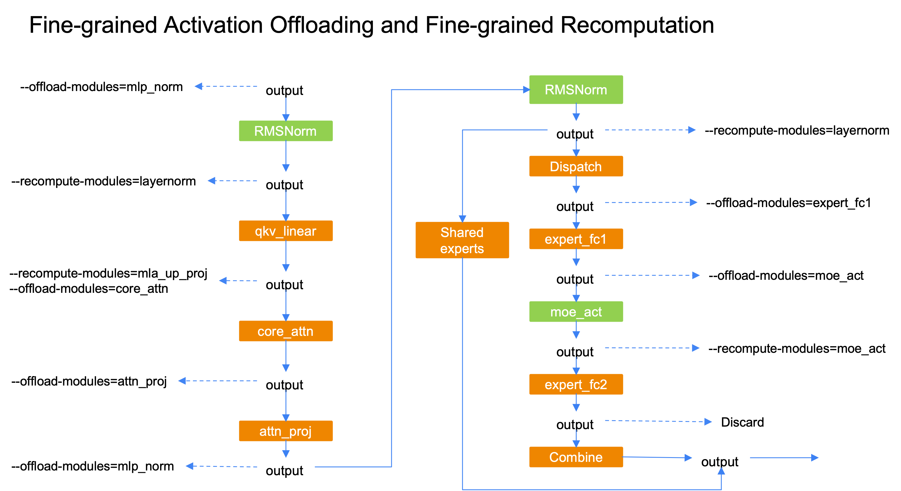

<!---
   Copyright (c) 2022-2026, NVIDIA CORPORATION. All rights reserved.
   NVIDIA CORPORATION and its licensors retain all intellectual property
   and proprietary rights in and to this software, related documentation
   and any modifications thereto. Any use, reproduction, disclosure or
   distribution of this software and related documentation without an express
   license agreement from NVIDIA CORPORATION is strictly prohibited.
-->

# 细粒度激活卸载（与 rednote 合作）

随着 DeepSeek-V3 和 Qwen3-235B 等极端稀疏 MoE 模型的兴起，内存容量变得越来越重要。细粒度重计算以额外的重计算为代价来减少内存占用，而卸载则可以利用主机-设备带宽实现近乎零开销。细粒度激活卸载旨在以特定模块为粒度卸载激活，这样我们就可以校准卸载激活的数量，以最大化训练吞吐量。

目前，支持的卸载模块有 `"attn_norm"`、`"core_attn"`、`"attn_proj"`、`"mlp_norm"`、`"expert_fc1"`、`"moe_act"`，它们可以与细粒度重计算配合使用，以释放 Transformer 层几乎所有的激活。

**特性**
* 支持 PP=1/PP/交错式 PP
* 兼容细粒度重计算
* 支持 FP8
* 支持 MTP
* 支持混合稠密层和 MoE 层
* 支持 A2A 重叠
* 支持 CUDA Graph
  * （临时）CUDA 图作用域不能包含卸载模块

**使用方法**
```bash
# Enable fine-grained activation offloading
--fine-grained-activation-offloading

# Specify which modules are going to offload its input
# Choices: "attn_norm", "core_attn", "attn_proj", "mlp_norm", "expert_fc1", "moe_act".
--offload-modules expert_fc1
```
**与细粒度重计算兼容**
- 对于像 layernorm 或 moe_act 这样性能开销较小的模块，使用重计算来减少内存占用；
- 对于其他模块，使用卸载来减少内存占用；
- 确保卸载/重载操作可以与计算重叠；

