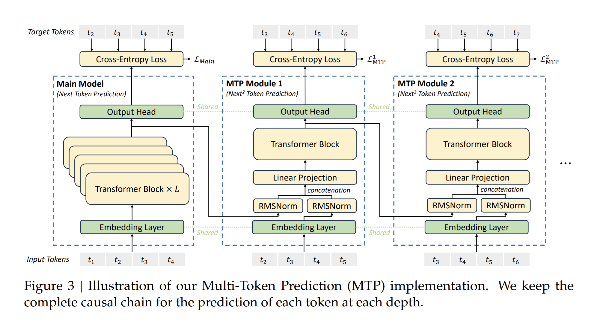

<!---
   Copyright (c) 2022-2026, NVIDIA CORPORATION. All rights reserved.
   NVIDIA CORPORATION and its licensors retain all intellectual property
   and proprietary rights in and to this software, related documentation
   and any modifications thereto. Any use, reproduction, disclosure or
   distribution of this software and related documentation without an express
   license agreement from NVIDIA CORPORATION is strictly prohibited.
-->

# 多令牌预测 (MTP)

多令牌预测 (Multi-Token Prediction, MTP) 将预测范围扩展到每个位置的多个未来令牌。一方面，MTP 目标函数使训练信号更加密集，可能提高数据效率。另一方面，MTP 可能使模型能够预先规划其表示，以更好地预测未来的令牌。在我们实现的 MTP 中，我们顺序预测额外的令牌，并在每个预测深度保持完整的因果链。下图展示了我们在 [DeepSeek-V3](https://github.com/deepseek-ai/DeepSeek-V3/) 中实现的 MTP。

第 k 个 MTP 模块由一个共享的嵌入层、一个投影矩阵、一个 Transformer 块和一个共享的输出头组成。对于第 (k - 1) 个预测深度的第 i 个输入令牌，我们首先将第 i 个令牌的表示与第 (i + K) 个令牌的嵌入通过线性投影相结合。组合后的结果作为第 k 个深度的 Transformer 块的输入，以产生输出表示。

更多信息，请参阅 [DeepSeek-V3 技术报告](https://arxiv.org/pdf/2412.19437.pdf)

## 相关参数

我们可以通过将 `mtp_num_layers` 设置为一个正整数，来训练支持多令牌预测 (MTP) 的 GPTModel 类模型。

| 参数项 | 描述 |
| --- | --- |
| mtp_num_layers | 多令牌预测 (MTP) 层的数量。MTP 将预测范围扩展到每个位置的多个未来令牌。此 MTP 实现使用 D 个顺序模块来顺序预测 D 个额外的令牌。默认值为 None。 |
| mtp_loss_scaling_factor | 多令牌预测 (MTP) 损失的缩放因子。我们计算所有深度上 MTP 损失的平均值，并将其乘以该缩放因子以获得总的 MTP 损失，该损失作为一个额外的训练目标。默认值为 0.1。 |

## MTP 的流水线并行布局

MTP 支持使用自定义的 `pipeline_model_parallel_layout` 在流水线阶段之间灵活地放置 MTP 层。默认情况下，所有 MTP 层都放置在最后一个流水线阶段，但您可以自定义其放置位置。

### MTP 独立模式

当 MTP 层被放置在一个独立的虚拟流水线 (vpp) 阶段，且该阶段不在最后一个流水线秩 (rank) 上时，`mtp_standalone` 标志会自动设置为 `True`。此模式使 MTP 能够在自己的流水线阶段中独立运行。

### 布局格式

在流水线布局字符串中使用 `m` 来表示 MTP 层。例如：
- `"E|t*3|(t|)*5mL"` - MTP 在最后一个阶段
- `"E|t*3|(t|)*4tm|L"` - MTP 在倒数第二个阶段，带有一个解码器层
- `"E|t*3|(t|)*3tt|m|L"` - MTP 在一个独立的阶段（倒数第二个），没有其他层
### 约束条件

- 所有 MTP 层必须放置在同一个虚拟流水线阶段中。
- MTP 层不能放置在第一个流水线秩上。

## 实现说明

- 对于包含 MTP 层的模型，最终的层归一化被放置在包含最后一个解码器层的阶段中，而不是在后处理阶段。在确定性模式下，当最终的层归一化被放置在不同的流水线阶段时，这可能会导致梯度范数缩减存在微小的数值差异。可以通过禁用梯度范数裁剪来实现比特级对齐。
- MTP 损失在后处理阶段计算。

## 注意事项

请勿将上下文并行、任意的注意力掩码类型或学习到的绝对位置嵌入类型与 MTP 一起使用。这些用例目前尚未得到支持。